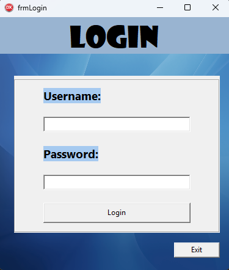
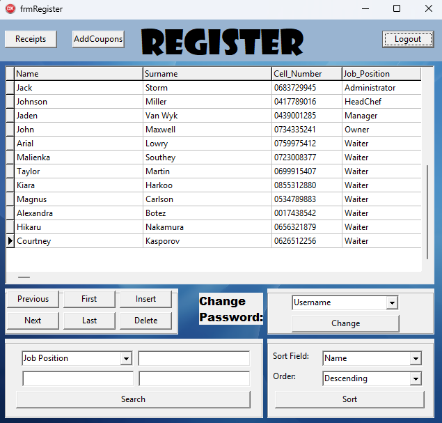
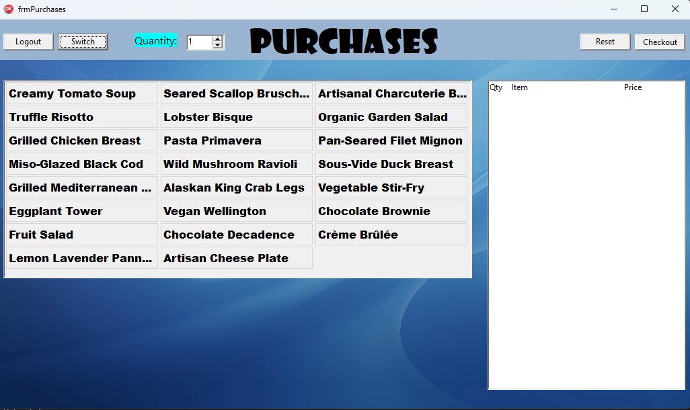
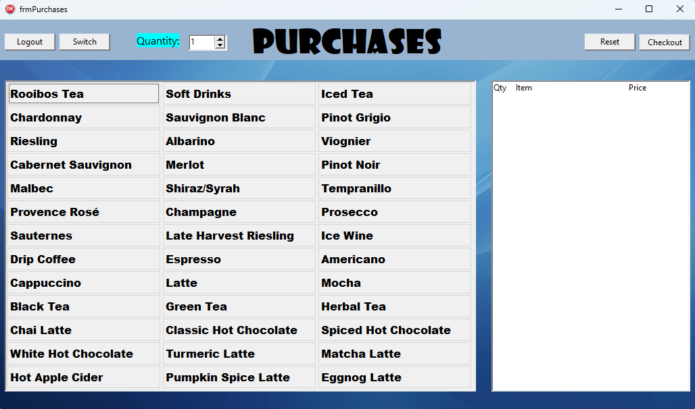
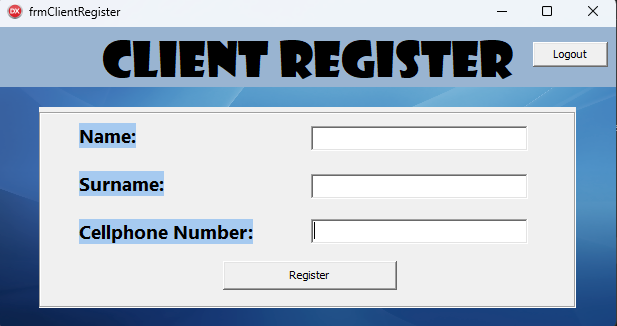
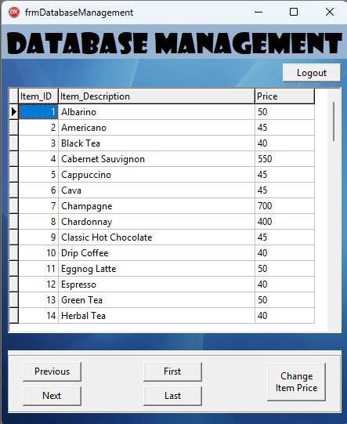
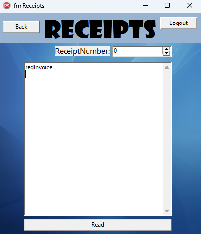

# 🧾 Point of Sale (POS) System (Grade 11 PAT)

A Delphi-based Point of Sale (POS) system developed as a Grade 11 Practical Assessment Task (PAT). The application simulates a restaurant ordering and billing process, allowing users to browse menu items, create orders, calculate totals, and generate receipts.

---

## 📌 Features

- Menu browsing and item selection
- Order creation and management
- Quantity adjustment for ordered items
- Automatic total cost calculation
- Receipt generation
- User-friendly graphical interface
- Desktop application developed in Delphi

---

## 🖥️ Application Workflow

1. Browse the available menu items
2. Select products to add to an order
3. Adjust quantities as required
4. Review the order summary
5. Calculate the final total
6. Generate a receipt

---

## 🧠 Concepts Demonstrated

- Event-driven programming
- Object-oriented programming
- User interface design
- Data validation
- Transaction processing logic
- File handling
- Structured program design

---

## 🛠️ Technologies Used

- Delphi (Object Pascal)
- Windows VCL Application
- File-based data storage
- Access database usage and TADO used

---

## 📸 Application Forms

| Form | Screenshot |
|------|------------|
| Login |  |
| Register User |  |
| Menu Selection (Food) |  |
| Menu Selection (Beverages) |  |
| Client Register |  |
| Order Summary |  |
| Receipt |  |

---

## 🔑 Test Login Details

The following account can be used to access the application:

| Role | Username | Password | 
|----------|----------|----------|
| Waiter | TaylMart0699 | TaylMart5407 |
| Owner | JohnMax0734 | JohnMaxw5241 |
| Manager | JadeVanW0439 | JadeVanW1285 |
| HeadChef | JohnMill0417 | JohnMill9016 |
| Administrator | JackStor0683 | JackStor9945 |

Alternatively, users may register a new account through the registration screen using the owner account.
     
---

## 🚀 Future Improvements

- Improved user interface design
- Inventory management system
- User authentication and permissions
- Enhanced reporting and analytics

---

## 👤 Author

Deon Harmse  
BSc Computer Science & Mathematical Statistics Student  
University of Cape Town (UCT)

---

## 📄 License

This project was developed for educational purposes as part of a Grade 11 Practical Assessment Task (PAT).
